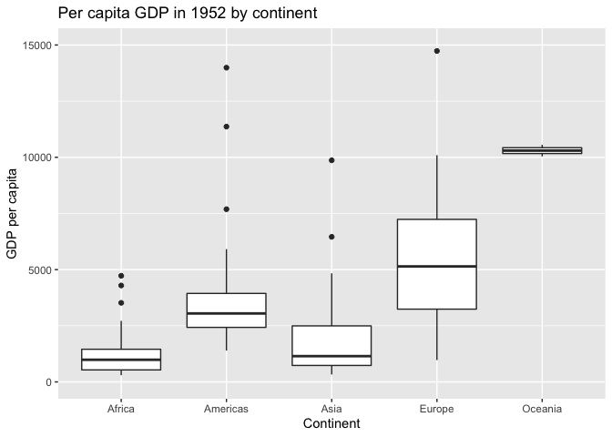
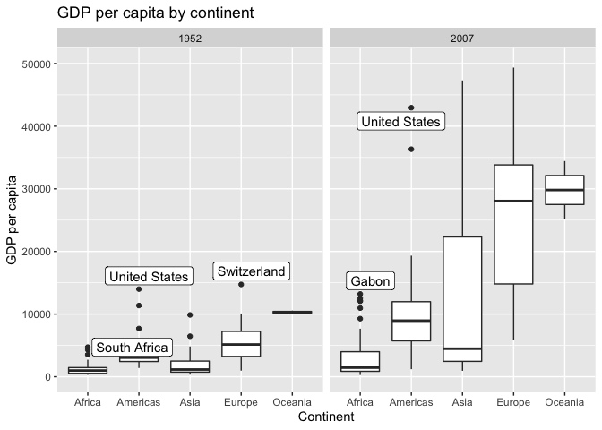
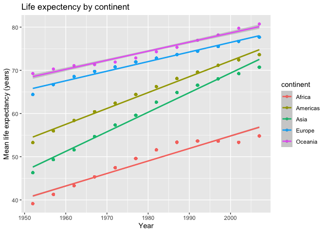
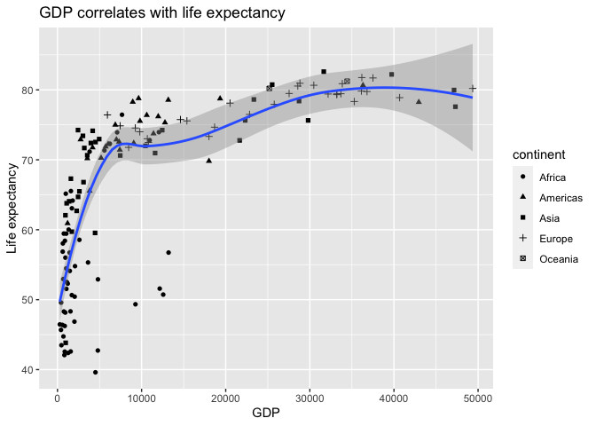
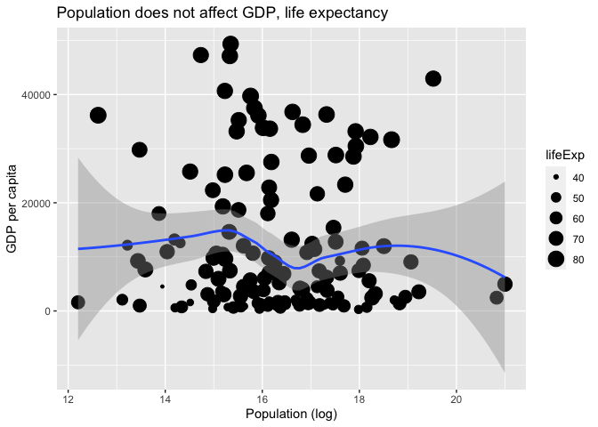

Gapminder
================
Kathryn
2020-07-21

  - [Grading Rubric](#grading-rubric)
      - [Individual](#individual)
      - [Team](#team)
      - [Due Date](#due-date)
  - [Guided EDA](#guided-eda)
  - [Your Own EDA](#your-own-eda)

*Purpose*: Learning to do EDA well takes practice\! In this challenge
you’ll further practice EDA by first completing a guided exploration,
then by conducting your own investigation. This challenge will also give
you a chance to use the wide variety of visual tools we’ve been
learning.

<!-- include-rubric -->

# Grading Rubric

<!-- -------------------------------------------------- -->

Unlike exercises, **challenges will be graded**. The following rubrics
define how you will be graded, both on an individual and team basis.

## Individual

<!-- ------------------------- -->

| Category    | Unsatisfactory                                                                   | Satisfactory                                                               |
| ----------- | -------------------------------------------------------------------------------- | -------------------------------------------------------------------------- |
| Effort      | Some task **q**’s left unattempted                                               | All task **q**’s attempted                                                 |
| Observed    | Did not document observations                                                    | Documented observations based on analysis                                  |
| Supported   | Some observations not supported by analysis                                      | All observations supported by analysis (table, graph, etc.)                |
| Code Styled | Violations of the [style guide](https://style.tidyverse.org/) hinder readability | Code sufficiently close to the [style guide](https://style.tidyverse.org/) |

## Team

<!-- ------------------------- -->

| Category   | Unsatisfactory                                                                                   | Satisfactory                                       |
| ---------- | ------------------------------------------------------------------------------------------------ | -------------------------------------------------- |
| Documented | No team contributions to Wiki                                                                    | Team contributed to Wiki                           |
| Referenced | No team references in Wiki                                                                       | At least one reference in Wiki to member report(s) |
| Relevant   | References unrelated to assertion, or difficult to find related analysis based on reference text | Reference text clearly points to relevant analysis |

## Due Date

<!-- ------------------------- -->

All the deliverables stated in the rubrics above are due on the day of
the class discussion of that exercise. See the
[Syllabus](https://docs.google.com/document/d/1jJTh2DH8nVJd2eyMMoyNGroReo0BKcJrz1eONi3rPSc/edit?usp=sharing)
for more information.

``` r
library(tidyverse)
```

    ## ── Attaching packages ────────────────────────────────────────────────────────────────── tidyverse 1.3.0 ──

    ## ✓ ggplot2 3.3.2     ✓ purrr   0.3.4
    ## ✓ tibble  3.0.1     ✓ dplyr   1.0.0
    ## ✓ tidyr   1.1.0     ✓ stringr 1.4.0
    ## ✓ readr   1.3.1     ✓ forcats 0.5.0

    ## ── Conflicts ───────────────────────────────────────────────────────────────────── tidyverse_conflicts() ──
    ## x dplyr::filter() masks stats::filter()
    ## x dplyr::lag()    masks stats::lag()

``` r
library(gapminder)
```

*Background*: [Gapminder](https://www.gapminder.org/about-gapminder/) is
an independent organization that seeks to education people about the
state of the world. They promote a “fact-based worldview” by focusing on
data. The dataset we’ll study in this challenge is from Gapminder.

# Guided EDA

<!-- -------------------------------------------------- -->

First, we’ll go through a round of *guided EDA*. Try to pay attention to
the high-level process we’re going through—after this guided round
you’ll be responsible for doing another cycle of EDA on your own\!

**q0** Perform your “first checks” on the dataset. What variables are in
this dataset?

``` r
## TASK: Do your "first checks" here!
glimpse(gapminder)
```

    ## Rows: 1,704
    ## Columns: 6
    ## $ country   <fct> Afghanistan, Afghanistan, Afghanistan, Afghanistan, Afghani…
    ## $ continent <fct> Asia, Asia, Asia, Asia, Asia, Asia, Asia, Asia, Asia, Asia,…
    ## $ year      <int> 1952, 1957, 1962, 1967, 1972, 1977, 1982, 1987, 1992, 1997,…
    ## $ lifeExp   <dbl> 28.801, 30.332, 31.997, 34.020, 36.088, 38.438, 39.854, 40.…
    ## $ pop       <int> 8425333, 9240934, 10267083, 11537966, 13079460, 14880372, 1…
    ## $ gdpPercap <dbl> 779.4453, 820.8530, 853.1007, 836.1971, 739.9811, 786.1134,…

``` r
summary(gapminder)
```

    ##         country        continent        year         lifeExp     
    ##  Afghanistan:  12   Africa  :624   Min.   :1952   Min.   :23.60  
    ##  Albania    :  12   Americas:300   1st Qu.:1966   1st Qu.:48.20  
    ##  Algeria    :  12   Asia    :396   Median :1980   Median :60.71  
    ##  Angola     :  12   Europe  :360   Mean   :1980   Mean   :59.47  
    ##  Argentina  :  12   Oceania : 24   3rd Qu.:1993   3rd Qu.:70.85  
    ##  Australia  :  12                  Max.   :2007   Max.   :82.60  
    ##  (Other)    :1632                                                
    ##       pop              gdpPercap       
    ##  Min.   :6.001e+04   Min.   :   241.2  
    ##  1st Qu.:2.794e+06   1st Qu.:  1202.1  
    ##  Median :7.024e+06   Median :  3531.8  
    ##  Mean   :2.960e+07   Mean   :  7215.3  
    ##  3rd Qu.:1.959e+07   3rd Qu.:  9325.5  
    ##  Max.   :1.319e+09   Max.   :113523.1  
    ## 

**Observations**:

  - Variables are: country and year
  - Measurements are: lifeExp, pop, gdpPercap

**q1** Determine the most and least recent years in the `gapminder`
dataset.

``` r
## TASK: Find the largest and smallest values of `year` in `gapminder`
year_max <- max(gapminder$year)
year_min <- min(gapminder$year)
```

Use the following test to check your work.

``` r
## NOTE: No need to change this
assertthat::assert_that(year_max %% 7 == 5)
```

    ## [1] TRUE

``` r
assertthat::assert_that(year_max %% 3 == 0)
```

    ## [1] TRUE

``` r
assertthat::assert_that(year_min %% 7 == 6)
```

    ## [1] TRUE

``` r
assertthat::assert_that(year_min %% 3 == 2)
```

    ## [1] TRUE

``` r
print("Nice!")
```

    ## [1] "Nice!"

**q2** Filter on years matching `year_min`, and make a plot of the GDE
per capita against continent. Choose an appropriate `geom_` to visualize
the data. What observations can you make?

You may encounter difficulties in visualizing these data; if so document
your challenges and attempt to produce the most informative visual you
can.

``` r
## TASK: Create a visual of gdpPercap vs continent

# Plot
gapminder %>%
  filter(year == year_min) %>%

  ggplot() +
    geom_boxplot(aes(x = continent, y = gdpPercap)) +
    ylim(0, 15000) +  # remove outlier from plot
    labs(
      title = "Per capita GDP in 1952 by continent",
      x = "Continent",
      y = "GDP per capita"
    )
```

    ## Warning: Removed 1 rows containing non-finite values (stat_boxplot).

<!-- -->

``` r
# Issue identified - outlier in Asia
gapminder %>%
  filter(year == year_min) %>%
  filter(continent == "Asia")
```

    ## # A tibble: 33 x 6
    ##    country          continent  year lifeExp       pop gdpPercap
    ##    <fct>            <fct>     <int>   <dbl>     <int>     <dbl>
    ##  1 Afghanistan      Asia       1952    28.8   8425333      779.
    ##  2 Bahrain          Asia       1952    50.9    120447     9867.
    ##  3 Bangladesh       Asia       1952    37.5  46886859      684.
    ##  4 Cambodia         Asia       1952    39.4   4693836      368.
    ##  5 China            Asia       1952    44   556263527      400.
    ##  6 Hong Kong, China Asia       1952    61.0   2125900     3054.
    ##  7 India            Asia       1952    37.4 372000000      547.
    ##  8 Indonesia        Asia       1952    37.5  82052000      750.
    ##  9 Iran             Asia       1952    44.9  17272000     3035.
    ## 10 Iraq             Asia       1952    45.3   5441766     4130.
    ## # … with 23 more rows

**Observations**:

  - In 1952, the median GDP was lowest in Africa and Asia
  - The highest GDP was in Oceania, but that was comprised of only 2
    countries: Australia and New Zealand
  - The interquartile range is small for Oceania and Africa, whereas
    Europe has a large interquartile range, indicating there was
  - Kuwait, in Asia, has an unusually high GDP, outpacing the median GDP
    per capita of Europe by a factor of 20x and the median GDP per
    capita of the Americas by a factor of about 35x.

**Difficulties & Approaches**:

  - Originally, I created a standard box plot to visualize the data.
    However, there was an outlier in Asia (Kuwait) that makes the whole
    visualization less effective. I added a limit to the y axis to
    center around the most relevant data.

**q3** You should have found at least three outliers in q2. Identify
those outliers (figure out which countries they are).

*Note*: I realize the reasons for

``` r
## TASK: Identify the outliers from q2
gapminder %>%
  filter(year == year_min) %>%
  group_by(continent) %>%
  mutate(
    iqr = IQR(gdpPercap), # calculate IQR
    median = median(gdpPercap),
    bottom_whisker = quantile(gdpPercap, probs = c(0.25),) - 1.5*iqr, # lowest part of bottom whisker
    top_whisker = quantile(gdpPercap, probs = c(0.75),) + 1.5*iqr, # highest part of top whisker
    scale = gdpPercap / median
  ) %>%
  filter(gdpPercap > top_whisker | gdpPercap < bottom_whisker) %>%
  arrange(desc(scale))
```

    ## # A tibble: 9 x 11
    ## # Groups:   continent [4]
    ##   country continent  year lifeExp    pop gdpPercap   iqr median bottom_whisker
    ##   <fct>   <fct>     <int>   <dbl>  <int>     <dbl> <dbl>  <dbl>          <dbl>
    ## 1 Kuwait  Asia       1952    55.6 1.60e5   108382. 2286.  1207.         -2679.
    ## 2 Bahrain Asia       1952    50.9 1.20e5     9867. 2286.  1207.         -2679.
    ## 3 South … Africa     1952    45.0 1.43e7     4725.  920.   987.          -845.
    ## 4 United… Americas   1952    68.4 1.58e8    13990. 1512.  3048.           161.
    ## 5 Gabon   Africa     1952    37.0 4.21e5     4293.  920.   987.          -845.
    ## 6 Canada  Americas   1952    68.8 1.48e7    11367. 1512.  3048.           161.
    ## 7 Angola  Africa     1952    30.0 4.23e6     3521.  920.   987.          -845.
    ## 8 Switze… Europe     1952    69.6 4.82e6    14734. 3996.  5142.         -2752.
    ## 9 Venezu… Americas   1952    55.1 5.44e6     7690. 1512.  3048.           161.
    ## # … with 2 more variables: top_whisker <dbl>, scale <dbl>

**Observations**:

  - Identify the outlier countries from q2 Outlier countries, as defined
    by a standard boxplot (outside of IQR by IQR +/- 1.5\*IQR) are:
    Kuwait, Bahrain, South Africa, US, Gabon, Canada, Angola,
    Switzerland and Venezuela

**q4** Create a plot similar to yours from q2 studying both `year_min`
and `year_max`. Find a way to highlight the outliers from q3 on your
plot. Compare the patterns between `year_min` and `year_max`.

*Hint*: We’ve learned a lot of different ways to show multiple
variables; think about using different aesthetics or facets.

``` r
## TASK: Create a visual of gdpPercap vs continent
library(ggrepel)

# Identify outliers
outliers_year_min <- 
  gapminder %>%
  filter(year == year_min) %>%
  group_by(continent, year) %>%
  mutate(
    iqr = IQR(gdpPercap), # calculate IQR
    median = median(gdpPercap),
    top_whisker = quantile(gdpPercap, probs = c(0.75),) + 1.5*iqr, # highest part of top whisker
    scale = gdpPercap / median
  ) %>%
  filter(gdpPercap > top_whisker) %>%
  # filter(gdpPercap < 50000) %>%
  filter(gdpPercap == max(gdpPercap))

outliers_year_max <-
  gapminder %>%
  filter(year == year_max) %>%
  group_by(continent, year) %>%
  mutate(
    iqr = IQR(gdpPercap), # calculate IQR
    median = median(gdpPercap),
    top_whisker = quantile(gdpPercap, probs = c(0.75),) + 1.5*iqr, # highest part of top whisker
    scale = gdpPercap / median
  ) %>%
  filter(gdpPercap > top_whisker) %>%
  filter(gdpPercap == max(gdpPercap))

# Plot
gapminder %>%
  filter(year == year_min | year == year_max) %>%

  ggplot(aes(x = continent, y = gdpPercap)) +
    geom_boxplot() +
    geom_label_repel(data = outliers_year_min, aes(label = country)) +
    geom_label_repel(data = outliers_year_max, aes(label = country)) +
    ylim(0, 50000) +  # remove outlier from plot
    facet_wrap(~ year) +
    labs(
      title = "GDP per capita by continent",
      x = "Continent",
      y = "GDP per capita"
    )
```

    ## Warning: Removed 1 rows containing non-finite values (stat_boxplot).

    ## Warning: Removed 1 rows containing missing values (geom_label_repel).

<!-- -->

**Observations**:

  - The median GDP per capita has grown for each continent
  - Some outliers for continents have changed (e.g. Switzerland used to
    be an outlier in Europe in 1952, but no longer in 2007), whereas
    others remain outliers then and now (e.g. Uniterd States).
  - The medians for continents are still in the same order: Oceania
    still has the higher median GDP per capita, whereas Africa still has
    the lower median GDP per capita.
  - Interquartile ranges have grown significantly between 1952 and 2007.
  - Interestingly, there are no outliers in Asia, Europe or Oceania in
    2007. This is a change from 1952, where both Asia and Europe had
    outliers.

# Your Own EDA

<!-- -------------------------------------------------- -->

Now it’s your turn\! We just went through guided EDA considering the GDP
per capita at two time points. You can continue looking at outliers,
consider different years, repeat the exercise with `lifeExp`, consider
the relationship between variables, or something else entirely.

**q5** Create *at least* three new figures below. With each figure, try
to pose new questions about the data.

``` r
## TASK: Your first graph
gapminder %>%
  select(country, continent, year, lifeExp) %>%
  group_by(continent, year) %>%
  mutate(mean_life = mean(lifeExp)) %>%
  
  ggplot(aes(x = year, y = mean_life, color = continent)) +
    geom_point() +
    geom_smooth(method = "lm") +
    labs(
      title = "Life expectency by continent",
      x = "Year",
      y = "Mean life expectancy (years)"
    )
```

    ## `geom_smooth()` using formula 'y ~ x'

<!-- -->

**Observations**:

How has life expectancy changed over time per continent? Life expectancy
has risen \~10-20 years per continent. The gains are higher for
continents that had lower starting life expectancy.

``` r
## TASK: Your second graph
gapminder %>%
  filter(year == year_max) %>%
  
  ggplot(aes(x = gdpPercap, y = lifeExp)) +
    geom_point(aes(shape = continent)) +
    geom_smooth() +
    labs(
      title = "GDP correlates with life expectancy",
      x = "GDP",
      y = "Life expectancy"
    )
```

    ## `geom_smooth()` using method = 'loess' and formula 'y ~ x'

<!-- -->

``` r
# Pearson's correlation
gapminder %>%
  filter(year == year_max) %>%
  summarize(rho = cor(gdpPercap, lifeExp, method = "pearson"))
```

    ## # A tibble: 1 x 1
    ##     rho
    ##   <dbl>
    ## 1 0.679

``` r
# Spearman's correlation
gapminder %>%
  filter(year == year_max) %>%
  summarize(rho = cor(gdpPercap, lifeExp, method = "spearman"))
```

    ## # A tibble: 1 x 1
    ##     rho
    ##   <dbl>
    ## 1 0.857

**Observations**:

Does life expectancy correlate with GDP per capita? - Life expectancy
rises very quickly up to about \~$7,000 GDP per capita, about $20/day,
where there is an elbow in the plot. - Life expectancy appears to rise
slowly after hitting \~$20/day. Benefits of increased GDP per capita
appear to max out around $35,000 per year, or about \~$100/day. - Both
Pearson’s and Spearman’s correlation are high (0.68 and 0.86,
respectively).

``` r
## TASK: Your third graph
gapminder %>%
  filter(year == year_max) %>%
  
  ggplot(aes(x = log(pop), y = gdpPercap)) +
    geom_point(aes(size = lifeExp)) +
    geom_smooth() +
    labs(
      title = "Population does not affect GDP, life expectancy",
      x = "Population (log)",
      y = "GDP per capita"
    )
```

    ## `geom_smooth()` using method = 'loess' and formula 'y ~ x'

<!-- -->

``` r
# Pearson's correlation
gapminder %>%
  filter(year == year_max) %>%
  summarize(rho = cor(pop, lifeExp, method = "pearson"))
```

    ## # A tibble: 1 x 1
    ##      rho
    ##    <dbl>
    ## 1 0.0476

``` r
# Spearman's correlation
gapminder %>%
  filter(year == year_max) %>%
  summarize(rho = cor(pop, gdpPercap, method = "pearson"))
```

    ## # A tibble: 1 x 1
    ##       rho
    ##     <dbl>
    ## 1 -0.0557

``` r
# Pearson's correlation
gapminder %>%
  filter(year == year_max) %>%
  summarize(rho = cor(pop, lifeExp, method = "spearman"))
```

    ## # A tibble: 1 x 1
    ##       rho
    ##     <dbl>
    ## 1 0.00336

``` r
# Spearman's correlation
gapminder %>%
  filter(year == year_max) %>%
  summarize(rho = cor(pop, gdpPercap, method = "spearman"))
```

    ## # A tibble: 1 x 1
    ##       rho
    ##     <dbl>
    ## 1 -0.0646

**Observations**:

Does population affect GDP? - It does not appear that population affects
GDP, or vice versa. - It does not appear that population affects life
expectancy. - Correlation calculations for both reveal minimal
correlation.
